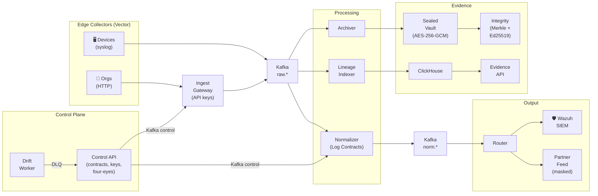

# Veyra

[](https://github.com/arnavmahajan630/Veyra/actions)


**Any log, however messy, is sealed as evidence the moment it arrives, normalized deterministically,
delivered to your SIEM, and traceable byte-for-byte back to its source.**

Veyra is an air-gapped **log pre-processing framework** designed for high-security environments. It sits in front of a SIEM such as Wazuh and:

- **seals** every raw log as tamper-evident evidence before anything parses it;
- **normalizes** it into [OCSF](https://ocsf.io) with a lineage extension (`ulpf`), grading how well it understood each line (tier 1 to 4) and never dropping one;
- **learns new formats** through Log Contracts that a local AI helps draft, with automatic checks and two-person approval;
- **proves** any event is untouched, and locates tampering if it isn't.

It is a pre-processor, not a SIEM: detection stays with the SIEM it feeds.

---

**Contents:**
[Quick start](#quick-start) · [What you get](#what-you-get) · [Commands](#commands) · [How it works](#how-it-works) · [Key concepts](#key-concepts) · [The web console](#the-web-console) · [The AI drafter](#choosing-the-ai-drafter) · [Profiles](#profiles) · [The guided demo](#the-guided-demo) · [Tech stack](#tech-stack) · [Repository layout](#repository-layout) · [Development](#development) · [Windows notes](#windows-notes) · [Troubleshooting](#troubleshooting) · [Further documentation](#further-documentation)

---

## Quick start

You need **Docker** and **git**. Nothing else is installed on your machine; every build and tool
runs in a container.

**Windows** (PowerShell, with Docker Desktop):

```powershell
git clone https://github.com/arnavmahajan630/Veyra
cd Veyra
.\veyra.ps1
```

**Linux, WSL or macOS:**

```bash
git clone https://github.com/arnavmahajan630/Veyra
cd Veyra
./veyra.sh
```

That single command:

1. checks the machine and picks a hardware profile (laptop or workstation);
2. clones the Log Contract registry next to the repo (`../contracts-repo`);
3. writes the runtime settings (`.env.runtime`) and data folders;
4. builds the Veyra image and the web console;
5. starts Kafka, ClickHouse, immudb, the edge collectors, Caddy and a Kafka UI, and creates the topics;
6. starts Wazuh (workstation profile), with certificates and security set up automatically;
7. starts the AI drafter's model server (you choose which kind, see below), on the GPU when Docker can see one, and downloads the model;
8. starts every Veyra service;
9. runs a smoke check: every service answers, a syslog line comes out the far end as OCSF and reaches Wazuh's input file, the evidence chain verifies, and the push gateway accepts a freshly issued key;
10. prints the URLs and sign-ins.

The first run downloads images and a model, so allow **10 to 25 minutes**. Later runs take one to
four minutes. Every stage is safe to re-run. If the smoke check fails, `up` says `FAILED` and exits
with an error, so a broken stack is never mistaken for a ready one.

Then:

```bash
./veyra.sh demo      # guided, narrated walkthrough of every feature (about 5 minutes)
./veyra.sh load      # Kafka and pipeline throughput test
```

On Windows, replace `./veyra.sh` with `.\veyra.ps1`.

## What you get

| What | Where | Sign in |
|---|---|---|
| Web console | http://localhost:8080 | `admin@veyra`, `author@maha` or `approver@veyra`; password `veyra-demo` |
| Kafka UI (topics, lag, live rates) | http://localhost:8085 | none (read-only) |
| Control API (OpenAPI) | http://localhost:8000/docs | same as the console |
| Evidence API (OpenAPI) | http://localhost:8100/docs | none |
| HTTP push, Splunk-HEC compatible | http://localhost:8088 | a per-source API key |
| Syslog in | UDP/TCP 5514/5515 (DMZ zone), 5524/5525 (core zone) | the source's registered host |
| Wazuh dashboard (when Wazuh is on) | https://localhost:8443 | `admin` / `admin` |

## Commands

| Command | What it does |
|---|---|
| `up` (default) | Set up and start everything, then smoke-check it |
| `demo` | Guided walkthrough of five beats. `--auto` runs without pauses, `--beat N` runs one beat (repeat it for several), `--no-reset` keeps the current state instead of resetting first |
| `load` | Stage A: Kafka alone (`--events N`, default 100M; `--record-size B`, default 200). Stage B: the real pipeline (`--pipeline N`, default 1M). `--skip-kafka`, `--skip-pipeline`, `--force` |
| `status` | Container list and a health check |
| `logs [service]` | Follow logs, e.g. `logs normalizer` |
| `reset` | Reset the whole demo world to its seeded state: control plane, Kafka, ClickHouse, vault, sinks and drift. The stack keeps running |
| `down` | Stop everything; data is kept |
| `wipe` | Stop everything and delete all data (asks first) |
| `doctor` | Check Docker, resources and ports |
| `help` | Print every command and option |

Every option, the settings files and worked examples are in
[`docs/SETUP_ADVANCED.md`](docs/SETUP_ADVANCED.md). On Windows, `.\veyra.ps1 -Via wsl` or
`-Via toolbox` forces a route (see Windows notes).

Options for `up`:

| Option | Default |
|---|---|
| `--profile laptop\|workstation\|mac` | Auto: `workstation` when Docker has at least 48 GB RAM and 12 CPUs, otherwise `laptop` |
| `--wazuh` / `--no-wazuh` | On for workstation, off for laptop |
| `--drafter ollama\|laya` | Asks on the first run, then remembers. With `--yes` or no terminal: `ollama` |
| `--laya` | Short for `--drafter laya` |
| `--decision-model NAME` | `laya:en`. The decision model to pull when the drafter is `laya` |
| `--no-llm` | The AI model is on. Without it, drafts come from saved answers or the rules drafter |
| `--model NAME` | The profile's model: `qwen2.5:3b` (laptop), `qwen2.5:14b` (workstation) |
| `--yes` | Don't ask before system changes, and don't ask which drafter |

## How it works



<details>
<summary>Text version (for terminals)</summary>

```
devices --syslog--> edge collectors (Vector) --+
orgs ----HTTP-----> ingest gateway (API keys) -+--> Kafka raw.* --+--> normalizer --> norm.* --> router --> Wazuh
                                                                   +--> archiver ----> sealed vault --> integrity (Merkle + Ed25519)
                                                                   +--> lineage indexer --> ClickHouse --> evidence API
control API (contracts, keys, four-eyes) --> Kafka `control` --> normalizer / gateway;  drift worker <-- dlq
```

</details>

Every service talks over Kafka topics or REST, behind one origin on port 8080 (Caddy). For the
plain-English and technical explanations, read the **Veyra, explained** doc and
[`docs/DEMO_GUIDE.md`](docs/DEMO_GUIDE.md). The design and decision log live in
[`docs/plan/`](docs/plan/README.md).

## Key concepts

| Concept | What it means |
|---|---|
| **Log Contract** | A declarative spec that maps raw log tokens to OCSF fields. Git-versioned, lint-checked, golden-tested, two-person-approved |
| **Tiers 1–4** | How well the normalizer understood a line. **Tier 1**: fully mapped by a contract. **Tier 2**: mapped with fallbacks. **Tier 3**: unknown shape — fields extracted heuristically (IPs, users, timestamps), with byte offsets. **Tier 4**: binary or garbage — passed through, never dropped |
| **ULPF** | Universal Log Provenance Format — the OCSF extension that carries byte offsets, contract version, tier, and Kafka coordinates for every event |
| **Four-eyes** | Two-person approval: the author of a contract cannot approve their own change (HTTP 403) |
| **Sealed vault** | zstd-compressed, AES-256-GCM encrypted segments with hash chains; files are read-only (`0444`) |
| **Signed root** | Every minute, a Merkle root over the vault's digests is signed with Ed25519 and chained |
| **Drift** | When new log shapes arrive that no contract covers, Drain3 clustering detects them and the AI drafter proposes a mapping |
| **Replay** | Once a new contract is approved, stored events are re-normalized as revision 2 — history is corrected after the fact |

## The web console

The console is a React 19 single-page application served through Caddy at http://localhost:8080.
Every page reads live data from the control plane, the lineage index, and the evidence API.

| Page | What it shows |
|---|---|
| **Overview** | Live pipeline flow, event rates by source, tier mix breakdown |
| **Sources** | Registered sources, per-source keys, status and health |
| **Onboard** | Step-by-step new source registration with sample analysis, AI-assisted contract drafting, and key issuance |
| **Contracts** | Contract lifecycle: versions, diffs, approvals, rollback, backtest |
| **Drift** | Unknown log shapes detected by Drain3 clustering, with draft proposals |
| **Lineage** | Search any event, see raw → normalized with byte-offset highlighting and revision timeline |
| **Evidence** | Verify the chain (7 of 8 steps), export proof packs, tamper matrix |
| **Delivery** | Route status and sink health |
| **Audit** | Full audit trail of all control-plane actions |

The hidden panel at `/demo` drives the guided walkthrough and offers `Shift+1`..`Shift+6` hotkeys
from any page. English and Hindi are supported.

### Choosing the AI drafter

When a new log format shows up, an AI proposes how its values map to fields; checks and a second
person's approval follow either way. Two kinds of model can do it:

| | `ollama` (default) | `laya` |
|---|---|---|
| What it is | An LLM that writes the draft, limited to fixed lists of answers | A decision model that picks from the same lists and gives a probability for each |
| Accuracy (27 test cases, RTX 4050) | Better: recall 0.45 to 0.59 | Lower: recall 0.33; good at the event type and outcome, leaves more values unmapped |
| Time per draft | 1 to 2 s on a GPU; too slow on a CPU, so the laptop profile uses saved drafts | About 0.1 s on a GPU and 1 to 2 s on a CPU, so it drafts live on every profile |
| Download | A few GB | Under 1 GB |

Switch at any time by re-running `up` with the other value: `./veyra.sh up --drafter laya`. The
numbers are in [`docs/plan/reports/C4.md`](docs/plan/reports/C4.md).

## Profiles

Sizes, partitions, limits and models all come from `profiles/<name>.env`; nothing is hard-coded.

| Profile | For | Highlights |
|---|---|---|
| `laptop` | 16 GB+ RAM | 1 normalizer, 3 partitions per topic, small heaps, Wazuh off, `qwen2.5:3b` with saved drafts |
| `workstation` | 64 to 128 GB RAM, 16+ cores, NVIDIA GPU | 6 normalizers for load tests, 12 partitions, Wazuh on, `qwen2.5:14b` drafting live on the GPU |
| `mac` | Apple Silicon, 32 to 64 GB | 2 normalizers, 6 partitions, `qwen2.5:7b`. Never auto-selected: pass `--profile mac` |

Put personal overrides in `.env.local` (git-ignored). It is applied after the profile.

## The guided demo

```bash
./veyra.sh demo          # pauses after each beat; press Enter
./veyra.sh demo --auto   # no pauses, runs straight through
```

The walkthrough runs five beats in about five minutes:

| Beat | Shows | Proves |
|---|---|---|
| **1. Syslog ingest** | Linux sshd and vendor CEF over real syslog | Each line is stamped (id, time, SHA-256) before parsing, queued, and translated to OCSF |
| **2. Messy logs** | OT historian (Hindi field names, no registered source) and binary garbage | Nothing is dropped — unknown shapes are tier 3, garbage is tier 4, both are delivered |
| **3. Onboard a new source** | Register a source, paste samples, get a draft contract, four-eyes approve, issue API keys, push events | Plug-and-play onboarding with revocable per-source keys |
| **4. Drift → replay** | 8 "FAILED login" events arrive as tier 3; drift detects them; AI drafts, second person approves, events replayed as revision 2 at tier 1 | Veyra learns an unseen format safely, with retroactive correction |
| **5. Evidence** | Verify the chain, tamper an event (insider with root + KEK), detect it at `merkle_inclusion`, restore, audit the ledger | Stored bytes are provably untouched; an edit is detected and located |

Each step prints PASS/FAIL and the run ends with a tally. See [`docs/DEMO_GUIDE.md`](docs/DEMO_GUIDE.md) for the full walkthrough, scope matrix, and load testing details.

## Tech stack

| Layer | Technology |
|---|---|
| Services | Python 3.12, FastAPI, confluent-kafka |
| Console | React 19, TypeScript, Vite, Tailwind CSS 4, Radix UI, TanStack Query |
| Messaging | Apache Kafka (KRaft mode, zstd, exactly-once semantics) |
| Storage | ClickHouse (lineage index), immudb (anchoring), AES-256-GCM vault |
| Edge | Vector (Datadog) — syslog and HTTP collectors in DMZ and core zones |
| Reverse proxy | Caddy (single origin on port 8080) |
| SIEM | Wazuh (optional, workstation profile) |
| AI drafter | Ollama (LLMs) or Laya (decision models) |
| Build | uv workspace (monorepo), ruff, mypy, pytest, Playwright |
| CI/CD | GitHub Actions (lint, unit tests, contract checks) |
| Containers | Docker Compose with hardware profiles (laptop / workstation / mac) |

## Repository layout

| Path | What's in it |
|---|---|
| `veyra.sh`, `veyra.ps1` | The one-command entry points |
| `services/` | The runnable services: ingest_gateway, normalizer, router, archiver, integrity, lineage_indexer, evidence_api, demo_engine, control_api, drift_worker |
| `packages/` | Shared libraries: `veyra_common`, `veyra_engine` (the normalizer), `veyra_evidence`, `veyra_lineage`, `veyra_contracts` (contracts + the AI drafter) |
| `console/` | The React web console |
| `compose/`, `docker/`, `profiles/` | Containers, images and per-machine settings |
| `edge/` | Vector edge collector configs and the source inventory |
| `wazuh/` | Wazuh add-ons: where Veyra's output is read and the custom rules |
| `demo/` | Sample logs and senders |
| `tools/` | Smoke check, guided demo, load generator, integration checkpoints, tamper lab, ledger audit, benches |
| `docs/` | [`DEMO_GUIDE.md`](docs/DEMO_GUIDE.md) (steps and scope), [`SETUP_ADVANCED.md`](docs/SETUP_ADVANCED.md) (every option of the setup script), `plan/` (design, contracts, status, reports) |
| `../contracts-repo` | The Log Contract registry: a separate git repo, cloned beside this one |

## Development

The project uses a **uv workspace** monorepo. Install [uv](https://docs.astral.sh/uv/), then:

```bash
uv sync --all-packages                      # install everything
uv run pytest -q -m "not int"               # unit tests (no containers needed)
uv run ruff check . && uv run ruff format --check .   # lint
uv run mypy packages services tools          # type check
make test-int                                # integration tests (stack must be up)
make ci                                      # what CI runs: lint + test + plan-check
```

For the console:

```bash
make console-dev       # dev server on :5173, /api proxied to caddy
make console-mock      # dev server against built-in fixtures, no backend needed
make console-test      # vitest unit tests
make console-e2e       # Playwright smoke tests
```

Integration checkpoints that gate the demo:

```bash
make cp1               # first light: syslog → norm → Wazuh sink, sealed segment, CH rows
make cp2               # messy + evidence: tier 3 with offsets, verify, signed roots
make cp3               # loop closed: onboard, drift, four-eyes, promote, replay, tamper
make cp4               # demo freeze: reset budget, scripted run, headroom, fallback
```

Run `make help` for the full list of targets.

**What is built today** (10 Oct 2026):
- Ingestion, normalization (tiers 1 to 4, byte offsets, shadow and replay), the router to Wazuh and a masked partner feed, the control plane, drift and the AI drafter are built.
- The whole console is built and reads live data: Overview, Sources, Onboard, Contracts, Drift, Lineage, Evidence, Delivery, Audit, and the hidden demo panel at `/demo`.
- The evidence side runs as working prototypes: the archiver, the Merkle and Ed25519 integrity service, the evidence API and the tamper lab. **Verify checks 7 of its 8 steps** — the eighth anchors the signed root in immudb and is declared not implemented; it reports itself as such everywhere rather than showing a tick it has not earned.
- The demo engine drives the whole 5-minute script, and the `Shift+1`..`Shift+6` hotkeys work from any console page.
- Sealed segments are mode `0444` and hash-chained, but not `chattr +i`: the vault resists an accidental edit, and a signed Merkle root outside it is what catches a deliberate one.
- `make cp1` to `make cp4` run the integration checkpoints that gate the demo; `docs/plan/06_STATUS_BOARD.md` records each run.

[`docs/DEMO_GUIDE.md`](docs/DEMO_GUIDE.md) has the full scope matrix.

## Windows notes

`veyra.ps1` runs the same `veyra.sh` in one of two ways:

- **Through WSL**, when a WSL distro can reach Docker (Docker Desktop, Settings, Resources, WSL integration). This is fastest.
- **In a small toolbox container** otherwise. It needs only Docker Desktop.

When the repo sits on a Windows drive, Kafka's and ClickHouse's data go into Docker volumes, because
bind mounts across the Windows filesystem are too slow under load. For the fastest load tests,
clone the repo inside WSL (`~/Veyra`) and run `./veyra.sh` there.

The launcher also rewrites shell scripts and container configs to LF line endings when git
checked them out as CRLF.

## Troubleshooting

| Symptom | Fix |
|---|---|
| "Docker is not running" | Start Docker Desktop, or `sudo systemctl start docker`, and re-run |
| A port is busy (8080, 8088, 9092 ...) | `./veyra.sh doctor` shows which. The console moves to 8081 automatically; stop whatever holds the other ports |
| Wazuh indexer keeps restarting | It needs `vm.max_map_count` at least 262144. `up` offers to set it; on Linux it resets at reboot |
| Cloning `contracts-repo` fails | Check your internet connection, or clone it manually: `git clone https://github.com/arnavmahajan630/contracts-repo ../contracts-repo` |
| The first build is slow | Expected: images, the console build and the model download (a few GB) happen once |
| Docker runs out of memory | Give Docker Desktop more memory (Settings, Resources, or `.wslconfig`). The laptop profile runs in about 8 GB and 12 GB is comfortable; the workstation profile with Wazuh needs about 40 GB |
| `up` ends with `FAILED` | The smoke check did not pass. `./veyra.sh status` shows each service; `./veyra.sh logs <service>` shows why |
| A demo beat times out or behaves oddly on a stack that has been up for days | Old events are in the way. `./veyra.sh reset` returns to the seeded state without rebuilding |
| Something is wrong and you want to start over | `./veyra.sh wipe`, then `./veyra.sh up` |
| A stage failed | Re-run the same command; every stage is idempotent. `./veyra.sh logs <service>` shows why |

## Further documentation

| Document | What it covers |
|---|---|
| [`DEMO_GUIDE.md`](docs/DEMO_GUIDE.md) | Demo beats, scope matrix, load testing, known limits |
| [`SETUP_ADVANCED.md`](docs/SETUP_ADVANCED.md) | Every option of the setup script, settings precedence, recipes |
| [`tamper_matrix.md`](docs/tamper_matrix.md) | What the tamper lab breaks and how each attack is caught |
| [`docs/plan/`](docs/plan/README.md) | Design documents, contracts spec, infrastructure profiles, changelog, status board |
| [`wazuh/REMOTE.md`](wazuh/REMOTE.md) | Shipping to an external Wazuh instance |
| `Makefile` (`make help`) | Every build, test, demo, and bench target |
